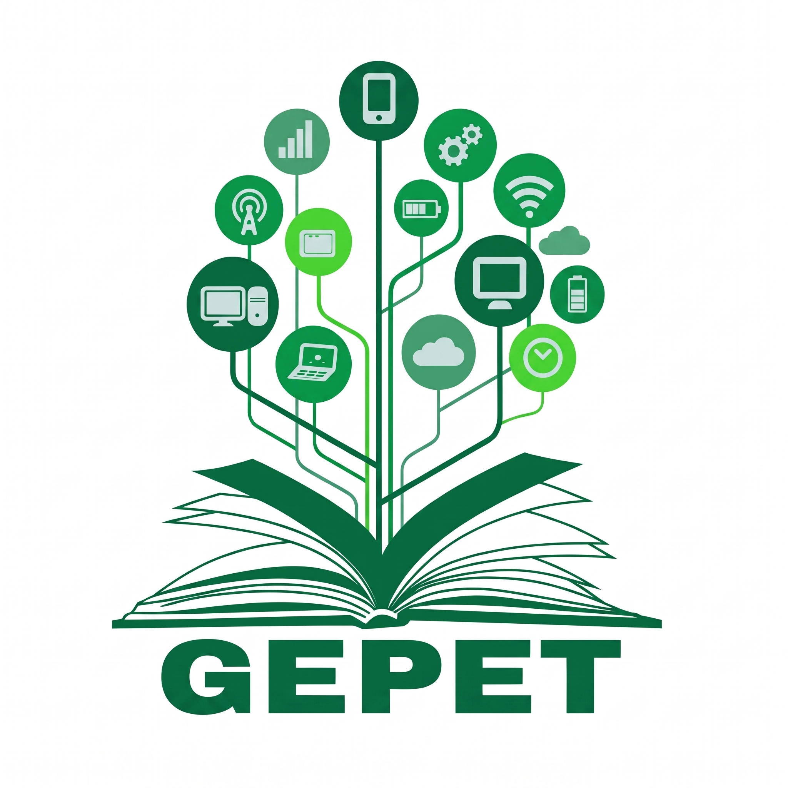

# Olá, somos o GEPET! 👋

  

<h3 align="center">Grupo de Estudos e Pesquisas em Práticas Educacionais Tecnológicas</h3>

  Vinculado ao <strong>Instituto Federal do Sertão Pernambucano (IFSertãoPE)</strong> — Campus Salgueiro. 
  Pesquisando e inovando na interseção entre educação, tecnologias, práticas pedagógicas e ciência.

  
  
  

---

## 📚 Sobre o Grupo

O **GEPET** (Grupo de Estudos e Pesquisas em Práticas Educacionais Tecnológicas) desenvolve estudos teóricos e práticos voltados para o contexto educacional, integrando as Tecnologias de Informação e Comunicação (TICs), metodologias de ensino, recursos educacionais abertos, inclusão e inovação pedagógica. 

Cadastrado no diretório de grupos do **CNPq**, o grupo fomenta a produção científica, o desenvolvimento de materiais educacionais e a formação continuada de professores e estudantes.

---

## 🎯 Nossas Linhas de Atuação e Foco

* **Educação e Tecnologia:** Integração de ferramentas computacionais, Ambientes Virtuais de Aprendizagem e metodologias ativas.
* **Práticas Pedagógicas Inovadoras:** Estratégias de ensino voltadas para o Ensino Médio Integrado e a Educação Profissional e Tecnológica (EPT).
* **Recursos Educacionais Abertos (REA):** Desenvolvimento e compartilhamento de materiais didáticos acessíveis e colaborativos.
* **Produção Científica:** Publicação de livros, artigos e organização de ciclos de palestras e eventos formativos.

---

  <em>"Tecnologia e educação caminhando juntas para transformar realidades."</em>

